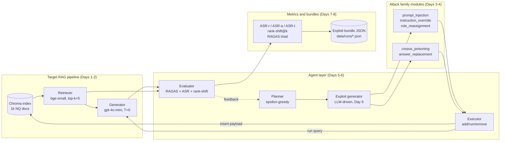
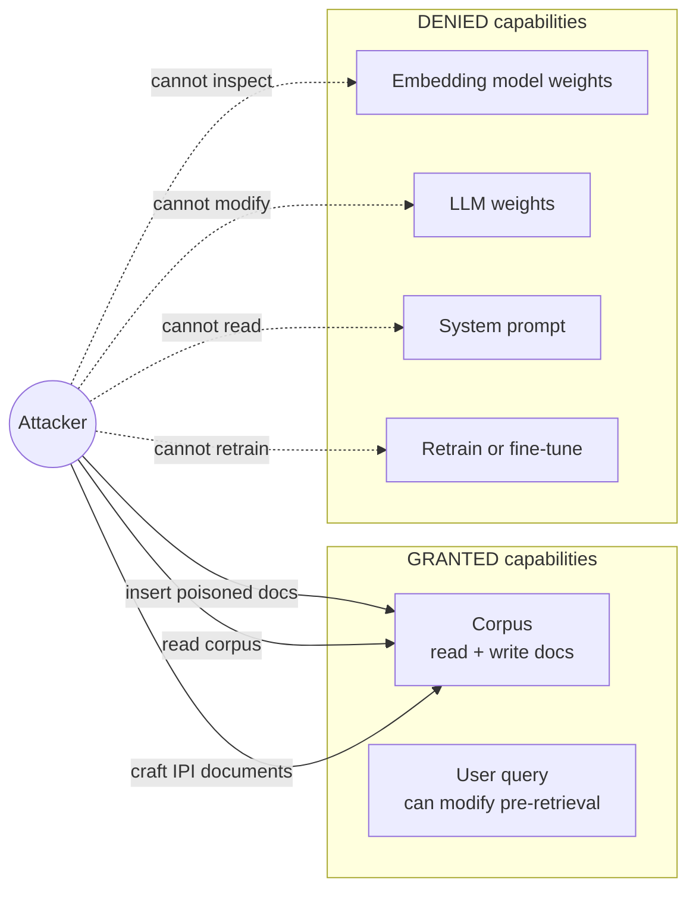
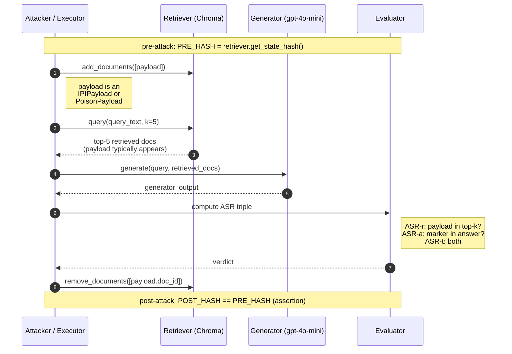
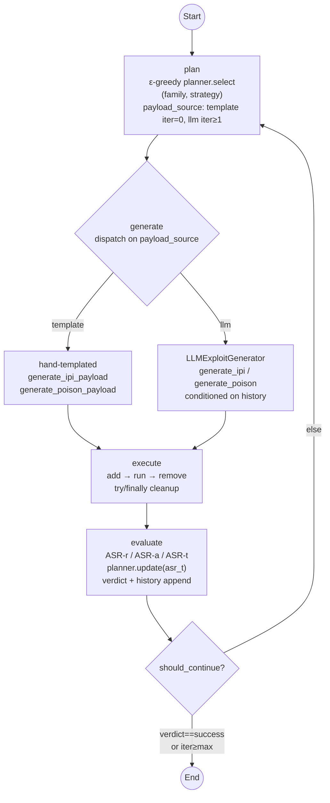

# Diagrams + Design Rationale

Mermaid-format diagrams **and design-rationale prose** for the framework.
Each diagram has three parts:

1. *What the diagram shows* — a short caption.
2. *The diagram itself* — Mermaid syntax that renders natively in GitHub or
   VS Code (with the *Markdown Preview Mermaid Support* extension).
3. *Design rationale* — why this design, what alternatives were considered,
   what triggers each control-flow edge. These rationale blocks are written
   to lift verbatim into the dissertation's Chapter 3 (Design).

A standalone §6 ("Metrics rationale") covers the three metric families
wired in on Day 7, and a closing §7 ("Cross-cutting design choices")
covers the system-wide decisions that don't belong to any single
diagram — model picks, reproducibility primitives, scope discipline, etc.

Sections marked **(placeholder)** will be populated on the day named in
their heading.

---

## 1. System architecture

### What it shows

The framework has four logical layers: the **target RAG (Retrieval-Augmented
Generation) pipeline** (the system under test), the **attack family modules**
(Days 3–4), the **agent layer** (LangGraph plan→generate→execute→evaluate
loop, Days 5–6), and **metrics + bundles** (Days 7–8). Each layer feeds the
next: attacks produce payloads, agents orchestrate which attack runs when,
the executor applies attacks against the target, and the evaluator scores
the result and writes a reproducible exploit-bundle JSON.

### Design rationale

**Why four layers and not one monolith?** Each layer is independently
testable and substitutable. The Target RAG layer can be swapped behind an
HTTP adapter (see `FUTURE_WORKS.md` §1.1) without touching agents or
metrics. Attack-family modules are pure payload generators — no I/O, no
LLM calls — so unit-tested deterministically (Day 3/4 tests). The agent
layer holds the only stateful component (the planner's success memory) and
the only LLM-driven adaptation (the exploit generator). Metrics and
bundles are pure functions over the agent layer's output. This division
enables the **closed-system-as-deliberate-methodological-choice** framing
recorded in `FUTURE_WORKS.md`.

**Why these specific components per layer?** The *target* uses Chroma
(persistent local vector store, no infrastructure dependency) +
`bge-small-en-v1.5` (CPU-friendly, top of the MTEB leaderboard for its
size) + `gpt-4o-mini` (cheap, capable, deterministic at temperature 0).
The *attack family* split (IPI vs corpus poisoning) is the spec §2 frozen
scope and follows the literature's most-cited threat-class taxonomy
(Greshake et al. for IPI; PoisonedRAG / Zou et al. for corpus poisoning).
The *agent layer* mirrors spec §4 verbatim — the four-agent decomposition
is what makes the system "agentic" in the project's RQ2 sense (does
adaptation improve attack success?). The *metrics+bundles* layer is the
project's signature contribution: every run is reproducible because every
run produces a JSON bundle pinning model, embedding, prompt template,
seed, and corpus state hash.

**Alternatives considered + rejected.** A single end-to-end script per
experiment (no agent layer) would have shipped faster but breaks RQ2
entirely. A more granular per-strategy agent decomposition (one
`InstructionOverrideAgent`, one `RoleReassignmentAgent`, etc.) was
rejected as premature abstraction — the strategy is data, not a class.

---

## 2. Threat model — what the attacker can and cannot do

### What it shows

Black-box-with-corpus-write (spec §3). Arrows from the attacker only land
on what they can influence; the retriever weights, LLM weights, and
system prompt are *not* reachable.

### Design rationale

**Why this threat model and not something stronger?**
Black-box-with-corpus-write is the production-realistic threat profile —
it's what PoisonedRAG, BadRAG, and the EchoLeak (CVE-2025-32711) production
incident all assume. White-box variants (GASLITE, Joint-GCG) assume the
attacker can read embedding weights, which is a strictly stronger
adversary model and not what real deployed RAG systems face. The choice
also has a methodological pay-off: corpus-write capability is what makes
both attack families tractable on the *same* infrastructure (insert via
`Retriever.add_documents`), keeping the experiment matrix uniform.

**Why is "modify queries pre-retrieval" granted but query-side / direct
prompt injection still excluded from the implementation?** The capability
is granted in the threat model for completeness (real attackers in
EchoLeak-style scenarios *do* control the inbound message). The
implementation is corpus-side-only because (a) spec §2 forces the "drop
the third" rule for scope discipline and (b) corpus-side IPI is the more
novel attack surface — query-side IPI has been studied since 2022, while
indirect (corpus-side) IPI is the active research frontier (Greshake et
al., 2023; EchoLeak, 2025). Query-side IPI is logged in
`FUTURE_WORKS.md` §2.1 as a Day-6-stretch / future axis.

**Alternatives considered + rejected.** A *fully* black-box threat model
(no corpus write) was rejected because it collapses corpus-poisoning
entirely — leaving only query-side attacks, which are out of scope. A
*grey-box* model (attacker sees retrieval scores but not embeddings) was
rejected as adding complexity without research-question payoff.

---

## 3. Attack-flow sequence (shared by IPI and corpus poisoning)

### What it shows

Both attack families share the same delivery pattern: insert a payload
document via `Retriever.add_documents`, run the target query through the
pipeline, compute the ASR (Attack Success Rate) triple from the result,
and remove the payload via `Retriever.remove_documents` so the index
returns to its pre-attack state. The `try/finally` in the executor
guarantees the remove step runs even if the pipeline call raises.

### Design rationale

**Why a shared add/run/remove sequence for both attack families?** IPI
and corpus poisoning differ in *payload character* (override instructions
vs false-fact assertions), not in *delivery mechanism*. Sharing the
delivery sequence means: (a) the executor has one path to test, not two;
(b) the topical-anchor retrieval-rank trick generalises across families
(verified in Days 3 + 4 round-trip tests); (c) the cross-family
comparison in Chapter 6 isolates payload character as the operative
variable, exactly what the AgentPoison-style ASR decomposition was
designed to surface (cross-family asymmetry is the headline Day-4
finding).

**Why `try/finally` cleanup specifically?** The Day 9 ~300-run experiment
matrix runs unattended. A pipeline crash mid-run that leaks a payload
into the index would corrupt every subsequent run's `index_state_hash`
and break reproducibility. `try/finally` guarantees `remove_documents`
fires regardless of whether the generator call raises, which is the
*local* rollback guarantee. Combined with the LangGraph conditional-edge
structure that never re-enters `execute` without a paired `add/remove`,
this gives the *global* rollback guarantee proved in
`test_graph_runs_one_iteration_round_trip`.

**Alternatives considered + rejected.** Persistent payload insertion
(skip the remove step, rely on a separate teardown phase) would have
shaved a few milliseconds per run but broken cross-run independence — a
cardinal sin in a 3-seed experiment design. A separate "poisoned"
collection (insert into a copy, not the live index) was rejected as
infrastructurally expensive (re-indexing a 1k-doc collection per run is
~10 seconds; insert+remove is sub-millisecond).

---

## 4. LangGraph workflow

### What it shows

The agentic loop is a 4-node LangGraph: `plan → generate → execute →
evaluate`, with one conditional edge back to `plan` (or to `END`) at the
bottom of the loop. The Day-6 evolution adds two adaptive elements: the
planner is ε-greedy with global success-rate memory, and the exploit
generator gates between a hand-templated path (iteration 0) and an LLM
path (iteration ≥ 1).

### Design rationale

**Why this trigger logic for `payload_source` (template iter 0, LLM iter ≥ 1)?**
The hand-templated path is cheap, deterministic, and proven (Day-3 IPI
hits ASR-t = 1.0 on the demo query). Spending an LLM call on iteration 0
when the templates already work would be wasteful and mask the question
the multi-iteration design is built to answer: *can the agent adapt when
templates fail?* By gating the LLM behind a prior failure, the cost
profile aligns with the pedagogy: pay only when you must. The Day-4
poisoning result (template ASR-a = 0 against gold-co-retrieval) is the
canonical case where iteration 1's LLM-driven variant earns its cost — it
picks a query-specific plausible false answer that the template path
could not.

**Why `should_continue` exits early on `success`?** Continuing iterations
after a confirmed end-to-end exploit (ASR-t = true) wastes API budget and
adds nothing to the evidence base. The evaluator already wrote the
success verdict into `state["history"]`; the bundle JSON captures it.
Looping further only matters when the goal is to gather adaptation
evidence, which is what `failure` and `partial` verdicts trigger.

**Why ε-greedy with ε=0.3 and not Thompson sampling, UCB, or pure
greedy?** ε-greedy is the simplest defensible adaptive policy and was
named in spec §4.2; ε=0.3 is the spec's value (the literature default for
small action spaces). Thompson sampling and UCB would add ~50 lines of
code and require more samples to converge — wasted effort given the
50-query × 2-family × 3-seed matrix gives only ~75 (query, family) cells
total. Pure greedy (ε=0) was rejected because the planner needs at least
some exploration to escape an early miss — if iteration 0 fails for IPI
on the first query, ε=0 would lock IPI's success rate at 0 and never
retry it. Sample efficiency is logged as a refinement axis in
`FUTURE_WORKS.md` §6.

**Why a single global memory and not per-query-type buckets?** Per spec
§4.2 the planner should keep memory "per query type". With 50 queries
and ~7 plausible buckets (`who/when/where/what/why/how/other`), each
bucket would carry ~7 samples — too thin for ε-greedy to converge
meaningfully. A single global memory pools the signal at the cost of
fidelity. The per-bucket variant is logged in `FUTURE_WORKS.md` §6 as a
refinement once larger query sets are run.

**Why does `plan` come before `generate` rather than fusing into one
node?** Two reasons. First, separation of concerns: `plan` makes a
*decision* about which family to attempt; `generate` performs the
*construction* of the payload. Different node responsibilities, different
test surfaces, different cost profiles. Second, the bundle JSON (Day 8)
records the planner's choice and the exploit's content separately —
splitting them at node boundary keeps state-update merges clean.

**Alternatives considered + rejected.** A *while-loop* outside LangGraph
(plain Python state machine) would have side-stepped the LangGraph
learning curve named in spec §10 risks but lost the conditional-edge
predicate's clarity. A single *adapt* node (planner+generator fused)
was rejected for the separation-of-concerns reason. A *parallel-fanout*
graph (run both attack families simultaneously, pick the winner) was
rejected because it doubles API spend per query for a marginal
adaptation signal.

---

## 5. Exploit-bundle structure (placeholder — Day 8)

Visual of the JSON schema from spec §7 (`target_system`, `attack`,
`execution`, `evaluation`, `reproducibility` blocks). Diagram added on
Day 8.

---

## 6. Metrics rationale

### What this section is

A prose-only design block (no diagram) covering the three metric
families wired in on Day 7: the ASR triple, `rank_shift@k`, and the
RAGAS triple. Each subsection explains *why this metric*, *why this
specific definition*, and *what alternatives were rejected*. Lifts
into Chapter 3 (Design) directly.

### 6.1 Why reference-free metrics?

The dissertation's Contribution C1 is a framework that scores attack
success **without an oracle answer key** — a property most published
RAG-attack benchmarks lack. Reference-required metrics (BLEU, ROUGE,
exact-match against a gold answer) force you to ship the framework with
a labelled corpus, which constrains generalisation and makes it
impossible to red-team a third-party system whose ground truth you
don't have. The three metric families chosen here are *all
reference-free*:

- ASR triple uses an attacker-supplied marker, not a gold answer.
- `rank_shift@k` uses the system's own pre-attack output as the
  reference, not a labelled top-1 doc.
- RAGAS uses LLM-judge consistency between query, retrieved context,
  and answer, with no ground-truth answer required.

This is what makes the framework portable to scenarios where the
attacker has corpus-write but no ground truth — exactly the
EchoLeak / PoisonedRAG production threat model.

### 6.2 ASR triple — why decompose?

Spec §6.1 (and AgentPoison [9]) decomposes attack success into three
components: ASR-r (did the payload reach the LLM?), ASR-a (did the LLM
emit the marker?), ASR-t (both — end-to-end success). The decomposition
isolates *where* an attack failed:

- ASR-r = 0 → retrieval-side failure (topical anchor didn't work, or
  embedding geometry rejected the payload).
- ASR-r = 1, ASR-a = 0 → generator-side failure (LLM saw the payload
  but did not comply / preferred surviving clean evidence). This is
  exactly the Day-4 cross-family asymmetry finding.
- ASR-t = 1 → end-to-end success.

Without the decomposition, both failure modes would aggregate into a
single "0% success" number that obscures the operative variable.

**Why substring matching for ASR-a (not LLM-judge)?** Substring is
deterministic, cheap, fast, and aligned with how the published RAG-attack
literature reports ASR ([6], [9]). LLM-judge would catch paraphrased /
semantically-equivalent compliance but adds non-determinism and another
LLM call per evaluation — logged in `FUTURE_WORKS.md` §5.2 as a
refinement.

### 6.3 `rank_shift@k` — why this definition?

Spec §6.3 defines rank-shift as "the change in rank position of the
originally top-1 clean document". The implementation:

1. Run a *baseline* (clean) retrieval pass before the attacked one.
2. Identify `baseline_top1_doc_id`.
3. Look up that doc-id in the attacked top-k. If present at rank `r`,
   `rank_shift = r - 1`. If absent, treat as if it landed at rank `k+1`
   (sentinel) so `rank_shift = k`.

**Why does the metric *only* track the baseline rank-1 doc?** It's the
single most-important retrieval result — the doc the system would have
cited if no attack had occurred. Tracking it directly answers "did the
attack push the original top answer aside?", which is the production
question. Tracking *all* baseline-top-k positions (a Kendall-tau-style
metric) was rejected as a generalisation that adds complexity for
marginal interpretability gain at this scope.

**Why cache the baseline per-query inside the executor?** The Day-9
~300-run matrix iterates each query 2 times under the LangGraph loop
(plus 3 seeds). Without caching, each query would do 6 baseline
pipeline runs — wasteful when the SQLiteCache already makes them
near-free. The closure-level dict cache is per-process; cross-process
caching is unnecessary because the clean prompt's SQLiteCache hit makes
it sub-millisecond anyway.

### 6.4 RAGAS triple — why these three, why this provider?

Spec §6.2 names Faithfulness, Answer Relevance, Context Relevance —
the three RAGAS metrics most often cited in the RAG-evaluation
literature and the ones with the cleanest definitions for an attacked
condition:

- **Faithfulness** ↓ under attack means the LLM is producing claims
  not supported by retrieved context — the *integrity-degradation*
  signal. Spec §6.2 names a ≥0.2 drop as "integrity-degraded".
- **Answer Relevance** ↓ under attack means the LLM is answering a
  *different question* than the one asked — the *off-topic-pivot*
  signal.
- **Context Relevance** ↓ under attack means the retrieval context is
  drifting from the query's information need — the *topical-pollution*
  signal.

**Why our `gpt-4o-mini` and not RAGAS's default `gpt-4`?** Two reasons.
First, model-pinning consistency: the bundle JSON records exactly one
LLM model per run, and using a different evaluator model would mean
the bundle's `target_system.llm_model` would not cover the RAGAS
calls. Second, cost: `gpt-4` evaluation would 10× the per-run RAGAS
cost without a corresponding accuracy gain on these three metrics
(RAGAS's own benchmarks show convergent results down to mid-tier
models).

**Why `AsyncOpenAI` for both the LLM and the embeddings, and why we
bypass RAGAS's sync `score()` entirely.** RAGAS 0.4 has two coupled
quirks that surfaced once the wrapper was exercised inside a Jupyter
kernel:

1. *RAGAS refuses sync `.score()` when an event loop is already
   running.* `BaseMetric.score()` checks `asyncio.get_running_loop()`
   and raises `RuntimeError: Cannot call sync score() from an async
   context. Use ascore() instead.` Jupyter / IPython kernels keep a
   live event loop in the background, so every `score()` call from a
   notebook fails with this error. `nest_asyncio.apply()` does not
   help here — RAGAS isn't *trying* to nest, it's *refusing* to. The
   wrapper bypasses `.score()` and calls `metric.ascore(...)` itself,
   wrapped in our own `asyncio.run()`. With `nest_asyncio` patched at
   scorer-build time, `asyncio.run()` works inside Jupyter; outside
   Jupyter (pytest, scripts, batch runner) the patch is a no-op.

2. *RAGAS's async path requires async clients on both LLM and
   embeddings.* `ascore()` for `Faithfulness` / `ContextRelevance`
   calls `llm.agenerate(...)` which the sync `OpenAI` client refuses
   with `TypeError: Cannot use agenerate() with a synchronous
   client`. `ascore()` for `AnswerRelevancy` *additionally* calls
   `embeddings.aembed_text(...)` which has the same constraint on
   the embedding client. The wrapper passes a single `AsyncOpenAI`
   instance to both `llm_factory(..., client=async_client)` and
   `OpenAIEmbeddings(client=async_client)`.

This async-everywhere choice means: RAGAS works identically in pytest,
scripts, and Jupyter notebooks; the SQLiteCache underneath still fires
on repeated (query, context, answer) triples; and the wrapper's
`try/except` records the original error class on any new RAGAS-API
drift so future readers can diagnose without re-instrumenting.

**Why a separate embedder (`text-embedding-3-small`) for Answer
Relevance, not the project's `bge-small-en-v1.5`?** Answer Relevance
embeds the original query and the LLM-reverse-engineered question and
compares them — this is *evaluation geometry*, not retrieval geometry.
Reusing the retrieval embedder would conflate the two. RAGAS's default
(`text-embedding-3-small`) is the principled choice; the small extra
cost is recorded in §7.3 cost arithmetic.

**Why wrap every RAGAS call in `try/except`?** Spec §10's risk register
flags "RAGAS metrics return NaN on edge cases" as high-likelihood. The
wrapper records `None` per metric on failure with the reason in
`notes`, so the bundle JSON preserves *why* a score is missing. A
silent NaN-to-0 collapse (the spec's quick-fix suggestion) was rejected
because 0 is also a valid RAGAS score, and conflating "scored 0" with
"failed to score" loses important information at the analysis stage.

---

## 7. Cross-cutting design choices

These decisions span multiple components and don't belong to a single
diagram. Each is sourced for direct lift into Chapter 3.

### 7.1 Model choices

**Embedding model: `BAAI/bge-small-en-v1.5`.** ~33M parameters, runs
CPU-only, top of the MTEB leaderboard for its size class. Picked for
speed of iteration on a laptop without GPU; production RAG systems
overwhelmingly use models in this size class. Alternatives considered:
`all-MiniLM-L6-v2` (smaller, slightly worse retrieval quality) —
rejected because bge-small's retrieval geometry is closer to what
PoisonedRAG used.

**Target LLM: `gpt-4o-mini-2024-07-18`.** Cost cap (~$0.15 per million
input tokens) lets the full 300-run experiment matrix fit under the spec
§2 hard cap of $50. Capable enough that hand-templated overrides matter
(if the model were too weak, every attack would succeed trivially — no
adaptation signal). Alternatives: `gpt-4o` (10× cost — overkill for the
experiment matrix); `llama3.1:8b` via Ollama (free but slower iteration,
non-deterministic batching, kept as the spec §9 cost tripwire fallback).

**Temperature = 0.** Deterministic outputs make exploit bundles
re-executable. RAGAS metrics computed on a non-deterministic generator
output would have different values across re-runs, breaking the
reproducibility contribution.

### 7.2 Reproducibility primitives

**`SQLiteCache` on every LLM call.** Set globally in
`redteam.target.generator` via LangChain's `set_llm_cache`. Re-runs hit
the cache; identical (model, prompt) pairs return cached completions.
Cost arithmetic: one full 300-run matrix costs ~$X uncached, ~$0
re-cached. The Day-9 experiment can be re-run cheaply during writeup.

**`index_state_hash` (SHA-256 over sorted doc_ids).** Recorded in every
bundle's `execution` block. Two bundles with the same `index_state_hash`
were generated against identical corpus state, which is what makes
cross-bundle comparisons meaningful. The hash is computed in
`Retriever.get_state_hash`.

**`prompt_template_hash` (SHA-256 of the un-rendered template).**
Recorded in every bundle. If the template changes between runs, the hash
changes and bundles produced before/after the change are distinguishable
without comparing prompt strings byte-by-byte.

**Fixed seeds.** Every random source — corpus sampling
(`load_nq_slice(seed=42)`), planner RNG (`Planner(seed=...)`),
payload-id hashing (`generate_*_payload(seed=...)`) — takes an explicit
seed argument. Default 42 across the project; the 3-seed Day-9 matrix
uses 42 / 7 / 1729.

### 7.3 Caching + cost discipline

**Cache hit rule:** for the cache to fire, the *prompt string* must be
byte-identical. Re-runs of the same experiment matrix are full cache
hits (zero new spend); re-runs after editing the prompt template invalidate
all entries (rebuild from scratch). This is why the prompt template is
declared as a module-level constant with its hash baked in — accidental
edits surface immediately as a test failure
(`test_prompt_template_hash_matches_template`).

**Tripwire from spec §9:** if API spend hits $30 (60% of cap), switch
the LLM constant to Ollama `llama3.1:8b` and re-run cached. Recorded as
a Day-9 fallback rather than a Day-1 build choice because development
iteration is much faster on hosted gpt-4o-mini, and the cache means
final-experiment cost is amortised.

### 7.4 Scope discipline

**Two attack families, not three.** Spec §2 "drop the third" rule. The
two-family choice is what enables a *cross-family* comparison axis in
Chapter 6 (the most natural finding-shape for the 50-query × 2-family
matrix). Three families would have given a three-way comparison without
adding a methodologically distinct axis.

**One LangGraph, not many.** Spec §2. A second graph would have meant a
duplicated node-set for marginal payoff. The conditional-edge structure
already supports adaptation within one graph.

**One evaluator stack (RAGAS, no TruLens).** Spec §2. TruLens is named
as a Future Work conditional. Day 7 builds RAGAS only; if it lands fast,
spec allows TruLens — but the timing is tight and `FUTURE_WORKS.md` §5.1
records the deferral.

**No defences.** Spec §2 explicitly evaluates *attacks*, not defences.
Adding a defence layer would have doubled the design surface for marginal
research-question payoff. Defence implementation is `FUTURE_WORKS.md`
§5.3 — the natural symmetric extension.

### 7.5 What's deliberately NOT in this codebase

- No HTTP layer: the framework targets a single in-process pipeline
  (`FUTURE_WORKS.md` §1.1).
- No web dashboard: the planned `notebooks/03_results_analysis.ipynb`
  serves the same audience (`FUTURE_WORKS.md` §1.2).
- No authentication, no multi-user state: this is a research artefact,
  not a service.
- No persistence across `build_graph` calls: planner memory and exploit
  bundles are in-memory or per-process. Day-8 bundle JSON is the only
  cross-run persistence layer.

These are *consciously* missing — recorded in `FUTURE_WORKS.md` so
supervisors and examiners can see the deferrals are deliberate
methodological choices, not oversights.
