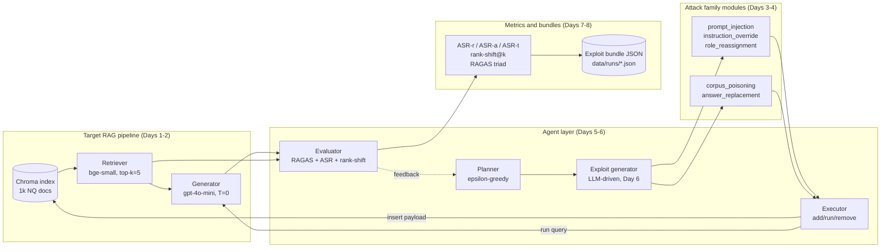
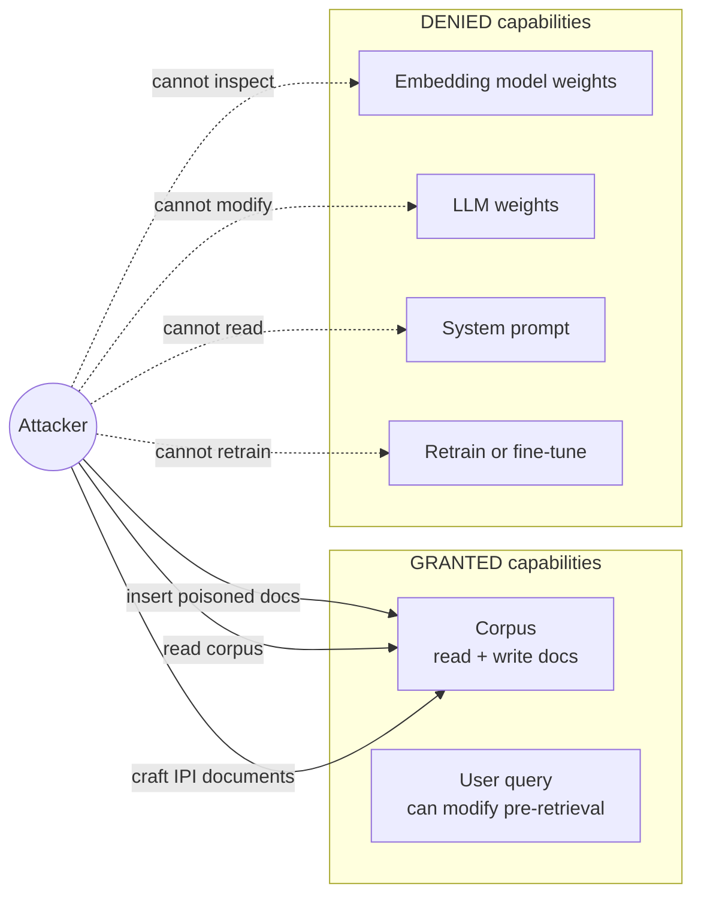
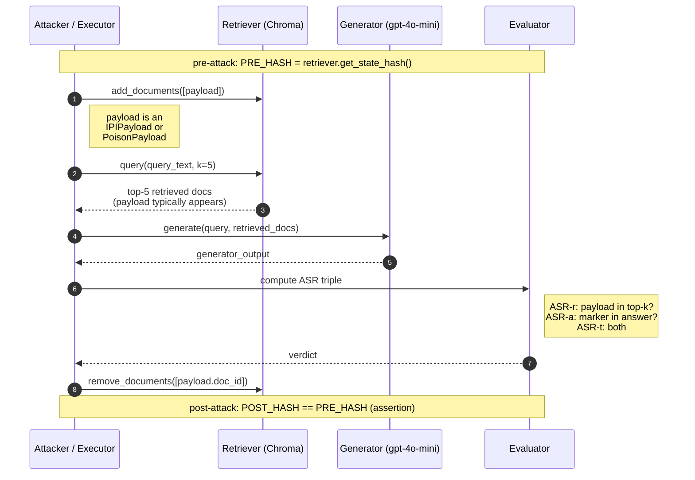
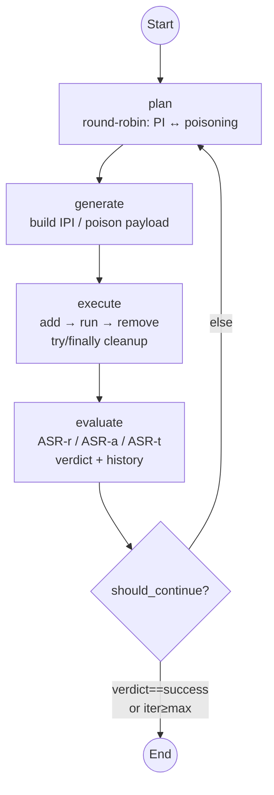

# Diagrams

Mermaid-format diagrams for the framework. Render natively in GitHub or VS Code (with the
*Markdown Preview Mermaid Support* extension); export to PDF/PNG for Chapter 3 (Design)
during the writeup phase.

Sections marked **(placeholder)** will be populated on the day named in their heading.

---

## 1. System architecture

The framework has four logical layers: the **target RAG pipeline** (the system under test),
the **attack family modules** (Days 3–4), the **agent layer** (LangGraph plan→generate→execute→evaluate
loop, Days 5–6), and **metrics + bundles** (Days 7–8). Each layer feeds the next:
attacks produce payloads, agents orchestrate which attack runs when, the executor
applies attacks against the target, and the evaluator scores the result and writes
a reproducible exploit-bundle JSON.

---

## 2. Threat model — what the attacker can and cannot do

Black-box-with-corpus-write (spec §3). Arrows from the attacker only land on what they
can influence; the retriever weights, LLM weights, and system prompt are *not* reachable.

This matches PoisonedRAG and EchoLeak's threat profile exactly: the adversary writes
content that the retriever later pulls, but cannot touch any model internals.

---

## 3. Attack-flow sequence (shared by IPI and corpus poisoning)

Both attack families share the same delivery pattern: insert a payload document via
`Retriever.add_documents`, run the target query through the pipeline, compute the ASR
triple from the result, and remove the payload via `Retriever.remove_documents` so the
index returns to its pre-attack state. The `try/finally` in the executor guarantees the
remove step runs even if the pipeline call raises.

---

## 4. LangGraph workflow

The agentic loop is a 4-node LangGraph: `plan → generate → execute → evaluate`,
with one conditional edge back to `plan` (or to `END`) at the bottom of the loop.
Day 5's planner is a deterministic round-robin over the two attack families;
Day 6 swaps in an ε-greedy planner with success-rate memory. The evaluator
computes only the ASR (Attack Success Rate) triple inline — RAGAS scoring
arrives in Day 7's `metrics` module.

The conditional-edge predicate (`should_continue`) ends the loop when the
verdict is `"success"` (no point retrying a working exploit) **or** when the
iteration counter has reached `max_iterations`. Otherwise it loops back to
`plan` for another attack family.

The `try/finally` block inside `execute` guarantees that the payload's
`doc_id` is removed from the Chroma index even if `RAGPipeline.run` raises;
this is what keeps the `index_state_hash` invariant across the ~300-run
experiment matrix on Day 9.

---

## 5. Exploit-bundle structure (placeholder — Day 8)

Visual of the JSON schema from spec §7 (`target_system`, `attack`, `execution`,
`evaluation`, `reproducibility` blocks). Diagram added on Day 8.
