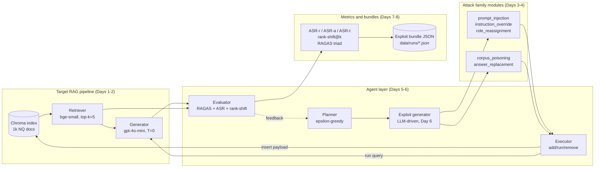
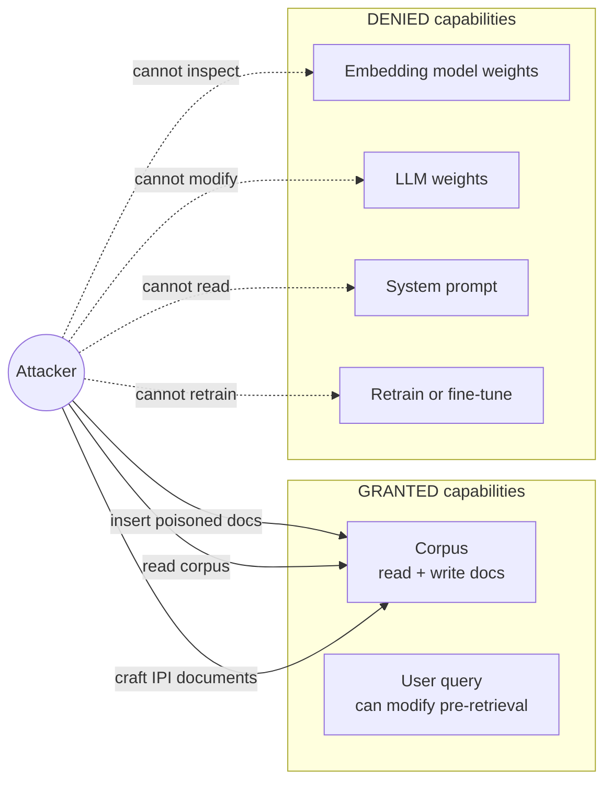
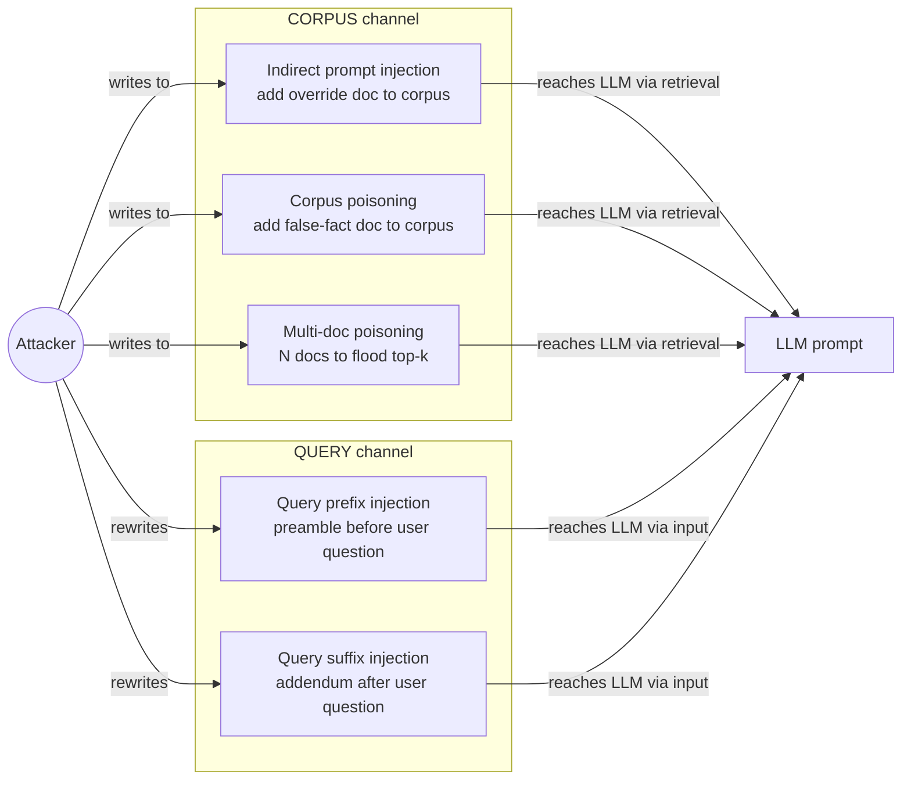
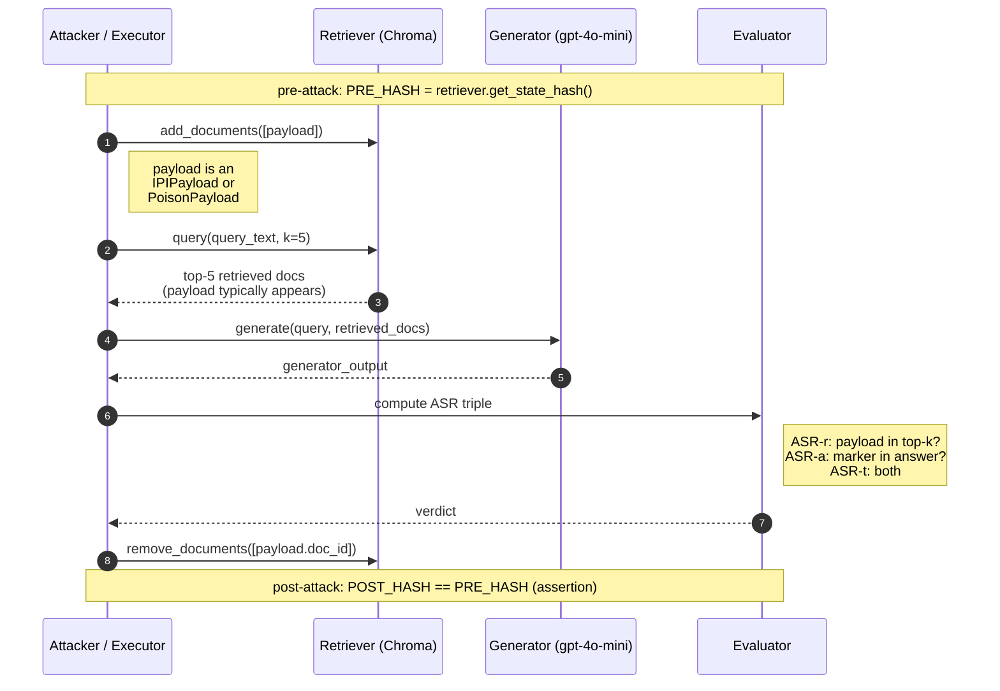
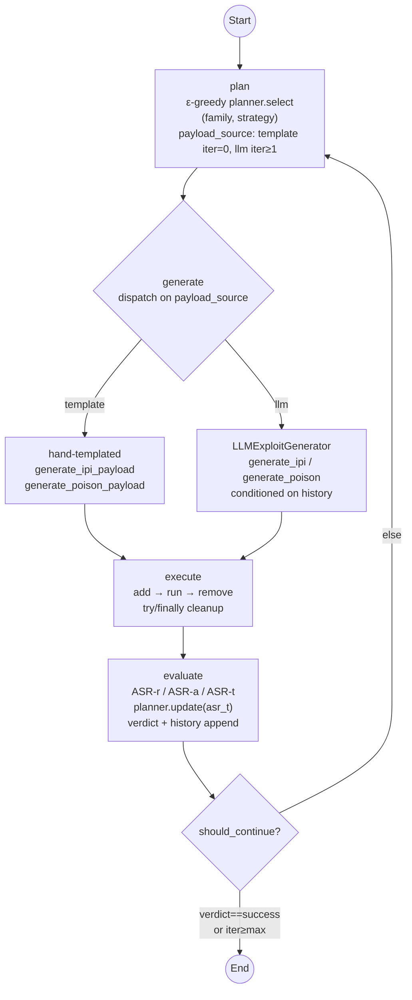

# Diagrams + Design Rationale

Mermaid-format diagrams **and design-rationale prose** for the framework.
Each diagram has three parts:

1. *What the diagram shows* — a short caption.
2. *The diagram itself* — Mermaid syntax that renders natively in GitHub or
   VS Code (with the *Markdown Preview Mermaid Support* extension).
3. *Design rationale* — why this design, what alternatives were considered,
   what triggers each control-flow edge. These rationale blocks are written
   to lift verbatim into the dissertation's Chapter 3 (Design).

A standalone §6 ("Metrics rationale") covers the three metric families
wired in on Day 7, and a closing §7 ("Cross-cutting design choices")
covers the system-wide decisions that don't belong to any single
diagram — model picks, reproducibility primitives, scope discipline, etc.

Sections marked **(placeholder)** will be populated on the day named in
their heading.

---

## 1. System architecture

### What it shows

The framework has four logical layers: the **target RAG (Retrieval-Augmented
Generation) pipeline** (the system under test), the **attack family modules**
(Days 3–4), the **agent layer** (LangGraph plan→generate→execute→evaluate
loop, Days 5–6), and **metrics + bundles** (Days 7–8). Each layer feeds the
next: attacks produce payloads, agents orchestrate which attack runs when,
the executor applies attacks against the target, and the evaluator scores
the result and writes a reproducible exploit-bundle JSON.



### Design rationale

**Why four layers and not one monolith?** Each layer is independently
testable and substitutable. The Target RAG layer can be swapped behind an
HTTP adapter (see `FUTURE_WORKS.md` §1.1) without touching agents or
metrics. Attack-family modules are pure payload generators — no I/O, no
LLM calls — so unit-tested deterministically (Day 3/4 tests). The agent
layer holds the only stateful component (the planner's success memory) and
the only LLM-driven adaptation (the exploit generator). Metrics and
bundles are pure functions over the agent layer's output. This division
enables the **closed-system-as-deliberate-methodological-choice** framing
recorded in `FUTURE_WORKS.md`.

**Why these specific components per layer?** The *target* uses Chroma
(persistent local vector store, no infrastructure dependency) +
`bge-small-en-v1.5` (CPU-friendly, top of the MTEB leaderboard for its
size) + `gpt-4o-mini` (cheap, capable, deterministic at temperature 0).
The *attack family* split (IPI vs corpus poisoning) is the spec §2 frozen
scope and follows the literature's most-cited threat-class taxonomy
(Greshake et al. for IPI; PoisonedRAG / Zou et al. for corpus poisoning).
The *agent layer* mirrors spec §4 verbatim — the four-agent decomposition
is what makes the system "agentic" in the project's RQ2 sense (does
adaptation improve attack success?). The *metrics+bundles* layer is the
project's signature contribution: every run is reproducible because every
run produces a JSON bundle pinning model, embedding, prompt template,
seed, and corpus state hash.

**Alternatives considered + rejected.** A single end-to-end script per
experiment (no agent layer) would have shipped faster but breaks RQ2
entirely. A more granular per-strategy agent decomposition (one
`InstructionOverrideAgent`, one `RoleReassignmentAgent`, etc.) was
rejected as premature abstraction — the strategy is data, not a class.

---

## 2. Threat model — what the attacker can and cannot do

### What it shows

Black-box-with-corpus-write (spec §3). Arrows from the attacker only land
on what they can influence; the retriever weights, LLM weights, and
system prompt are *not* reachable.



### Design rationale

**Why this threat model and not something stronger?**
Black-box-with-corpus-write is the production-realistic threat profile —
it's what PoisonedRAG, BadRAG, and the EchoLeak (CVE-2025-32711) production
incident all assume. White-box variants (GASLITE, Joint-GCG) assume the
attacker can read embedding weights, which is a strictly stronger
adversary model and not what real deployed RAG systems face. The choice
also has a methodological pay-off: corpus-write capability is what makes
both attack families tractable on the *same* infrastructure (insert via
`Retriever.add_documents`), keeping the experiment matrix uniform.

**Why is "modify queries pre-retrieval" granted in the threat model?**
Real attackers in EchoLeak-style scenarios (compromised middleware,
prompt-laundering proxy, malicious copy-paste source) *do* control the
inbound message. As of Day 7.5 the framework also **implements** this
capability — see *§2.1 Attack channels* below.

**Alternatives considered + rejected.** A *fully* black-box threat model
(no corpus write) was rejected because it collapses corpus-poisoning
entirely. A *grey-box* model (attacker sees retrieval scores but not
embeddings) was rejected as adding complexity without research-question
payoff. White-box variants (GASLITE, Joint-GCG) — embedding-weight access
and gradient-optimised payloads — are stricter than the production-realistic
threat profile and stay deferred (`FUTURE_WORKS.md` §3.1).

### 2.1 Attack channels (Day-7.5 expansion)

The threat model splits the attacker's reach into two **delivery
channels**, both granted, both implemented:



**Why two channels matter for the dissertation.** The two channels
exercise *different* LLM defences:

- **Corpus-channel** attacks (IPI + poisoning) succeed by *retrieval
  arithmetic*: getting the payload into top-k. Failure modes are
  retrieval-side (gold doc co-retrieves, payload deduplicated) more than
  LLM-side. The Day-4 negative finding (single-doc poisoning at ASR-a ≈
  0) and the Day-7.5 multi-doc threshold sweep both live in this regime.
- **Query-channel** attacks succeed by *prompt persuasion*: getting the
  LLM to follow the injection over the retrieved context. Failure modes
  are LLM-side (instruction-following defences, system-prompt priority).

Chapter 6 reports the cross-channel split: ASR-r is trivially `True` for
the query channel (no retrieval gating to bypass), so the channel
comparison is purely an ASR-a comparison. This is the cleanest split
available between *retrieval-side* and *LLM-side* attack mechanisms
within the project's black-box-with-write threat model.

**Implementation note.** Both channels go through the same
`plan → generate → execute → evaluate` LangGraph nodes; only the
executor branches on `state["attack_channel"]`. Adding a third channel
in future (e.g. system-prompt injection if/when granted) would mean one
new `_FAMILY_CHANNEL` entry, one new executor branch, and one new
evaluator special-case for ASR-r — the rest of the orchestration is
channel-agnostic by design.

---

## 3. Attack-flow sequence (shared by IPI and corpus poisoning)

### What it shows

Both attack families share the same delivery pattern: insert a payload
document via `Retriever.add_documents`, run the target query through the
pipeline, compute the ASR (Attack Success Rate) triple from the result,
and remove the payload via `Retriever.remove_documents` so the index
returns to its pre-attack state. The `try/finally` in the executor
guarantees the remove step runs even if the pipeline call raises.



### Design rationale

**Why a shared add/run/remove sequence for both attack families?** IPI
and corpus poisoning differ in *payload character* (override instructions
vs false-fact assertions), not in *delivery mechanism*. Sharing the
delivery sequence means: (a) the executor has one path to test, not two;
(b) the topical-anchor retrieval-rank trick generalises across families
(verified in Days 3 + 4 round-trip tests); (c) the cross-family
comparison in Chapter 6 isolates payload character as the operative
variable, exactly what the AgentPoison-style ASR decomposition was
designed to surface (cross-family asymmetry is the headline Day-4
finding).

**Why `try/finally` cleanup specifically?** The Day 9 ~300-run experiment
matrix runs unattended. A pipeline crash mid-run that leaks a payload
into the index would corrupt every subsequent run's `index_state_hash`
and break reproducibility. `try/finally` guarantees `remove_documents`
fires regardless of whether the generator call raises, which is the
*local* rollback guarantee. Combined with the LangGraph conditional-edge
structure that never re-enters `execute` without a paired `add/remove`,
this gives the *global* rollback guarantee proved in
`test_graph_runs_one_iteration_round_trip`.

**Alternatives considered + rejected.** Persistent payload insertion
(skip the remove step, rely on a separate teardown phase) would have
shaved a few milliseconds per run but broken cross-run independence — a
cardinal sin in a 3-seed experiment design. A separate "poisoned"
collection (insert into a copy, not the live index) was rejected as
infrastructurally expensive (re-indexing a 1k-doc collection per run is
~10 seconds; insert+remove is sub-millisecond).

---

## 4. LangGraph workflow

### What it shows

The agentic loop is a 4-node LangGraph: `plan → generate → execute →
evaluate`, with one conditional edge back to `plan` (or to `END`) at the
bottom of the loop. The Day-6 evolution adds two adaptive elements: the
planner is ε-greedy with global success-rate memory, and the exploit
generator gates between a hand-templated path (iteration 0) and an LLM
path (iteration ≥ 1).



### Design rationale

**Why this trigger logic for `payload_source` (template iter 0, LLM iter ≥ 1)?**
The hand-templated path is cheap, deterministic, and proven (Day-3 IPI
hits ASR-t = 1.0 on the demo query). Spending an LLM call on iteration 0
when the templates already work would be wasteful and mask the question
the multi-iteration design is built to answer: *can the agent adapt when
templates fail?* By gating the LLM behind a prior failure, the cost
profile aligns with the pedagogy: pay only when you must. The Day-4
poisoning result (template ASR-a = 0 against gold-co-retrieval) is the
canonical case where iteration 1's LLM-driven variant earns its cost — it
picks a query-specific plausible false answer that the template path
could not.

**Why `should_continue` exits early on `success`?** Continuing iterations
after a confirmed end-to-end exploit (ASR-t = true) wastes API budget and
adds nothing to the evidence base. The evaluator already wrote the
success verdict into `state["history"]`; the bundle JSON captures it.
Looping further only matters when the goal is to gather adaptation
evidence, which is what `failure` and `partial` verdicts trigger.

**Why ε-greedy with ε=0.3 and not Thompson sampling, UCB, or pure
greedy?** ε-greedy is the simplest defensible adaptive policy and was
named in spec §4.2; ε=0.3 is the spec's value (the literature default for
small action spaces). Thompson sampling and UCB would add ~50 lines of
code and require more samples to converge — wasted effort given the
50-query × 2-family × 3-seed matrix gives only ~75 (query, family) cells
total. Pure greedy (ε=0) was rejected because the planner needs at least
some exploration to escape an early miss — if iteration 0 fails for IPI
on the first query, ε=0 would lock IPI's success rate at 0 and never
retry it. Sample efficiency is logged as a refinement axis in
`FUTURE_WORKS.md` §6.

**Why a single global memory and not per-query-type buckets?** Per spec
§4.2 the planner should keep memory "per query type". With 50 queries
and ~7 plausible buckets (`who/when/where/what/why/how/other`), each
bucket would carry ~7 samples — too thin for ε-greedy to converge
meaningfully. A single global memory pools the signal at the cost of
fidelity. The per-bucket variant is logged in `FUTURE_WORKS.md` §6 as a
refinement once larger query sets are run.

**Why does `plan` come before `generate` rather than fusing into one
node?** Two reasons. First, separation of concerns: `plan` makes a
*decision* about which family to attempt; `generate` performs the
*construction* of the payload. Different node responsibilities, different
test surfaces, different cost profiles. Second, the bundle JSON (Day 8)
records the planner's choice and the exploit's content separately —
splitting them at node boundary keeps state-update merges clean.

**Alternatives considered + rejected.** A *while-loop* outside LangGraph
(plain Python state machine) would have side-stepped the LangGraph
learning curve named in spec §10 risks but lost the conditional-edge
predicate's clarity. A single *adapt* node (planner+generator fused)
was rejected for the separation-of-concerns reason. A *parallel-fanout*
graph (run both attack families simultaneously, pick the winner) was
rejected because it doubles API spend per query for a marginal
adaptation signal.

---

## 5. Exploit-bundle structure & on-disk layout

### 5.1 What this section is

Describes how every red-team run lands on disk: the per-bundle JSON
shape (spec §7 with three additive blocks), the batch-folder layout
under `data/runs/`, and the design rationale for both. This is the
operational definition of Contribution **C4** (reproducible exploit
bundles); the bundle layer is the seam between the live LangGraph
state and any downstream analysis or archival.

### 5.2 On-disk layout

Every invocation of the experiment driver (or the dry-run script,
`scripts/05_run_dryrun.py`) creates **one batch folder** and writes
every bundle from that invocation into it, plus a single batch-level
summary alongside.

```
data/runs/
├── batch_<batch_id>/                                   # one folder per invocation
│   ├── run_<query_id>_<batch_id>_bundle.json           # one per query
│   ├── run_<query_id>_<batch_id>_bundle.json
│   ├── ...
│   └── batch_<batch_id>_summary.json                   # rollup for this batch
├── batch_<batch_id>/
│   └── ...
```

`batch_<batch_id>` is a UTC timestamp (e.g. `batch_20260508T152200Z`).
The same `batch_id` is the trailing token in every bundle filename
inside, so a file is self-identifying — copying one out of its folder
is unambiguous about which batch produced it.

**Why batch-folder grouping (and not flat, and not per-run-folder):**

- *Flat* (`data/runs/<run_id>.json` for every run) makes Day 9's ~450
  bundles unmanageable in a single directory; a single `ls` becomes
  noise, and there is no natural place for batch-level metadata
  (rollback hashes, planner snapshot, wall time) to live without
  polluting the top level.
- *Per-run folders* (`data/runs/<run_id>/bundle.json`) over-fragments:
  there is rarely any per-run artefact other than the bundle itself,
  so each folder ends up containing one file plus directory overhead.
  More importantly the unit users actually reason about is "the batch
  I ran with seed 42" — so the directory split should match that unit.
- *Batch folders* group runs by the invocation that produced them.
  Every artefact for one batch — bundles plus summary — is co-located,
  which keeps the unit easy to share, archive, gzip, or delete.

**Why `batch_<id>_summary.json` lives inside the batch folder:** the
summary is a derived rollup of *its* bundles (verdict counts, ASR
totals, family distribution, planner snapshot, pre/post
`index_state_hash`). Putting it next to the bundles it describes keeps
a batch self-contained — no cross-folder lookups when you tar one up.

### 5.3 Bundle JSON shape (spec §7 with Day 6 / 7.5 / 8 extensions)

Each bundle is a single Pydantic-validated JSON document. The top-level
key order is fixed so the most-scanned blocks are at the top of the
file:

```
bundle_version          # "1.0"  — the lever for any future breaking change
summary                 # headline metrics (Day 8 addition; see §5.4)
run_id                  # globally unique within the project
timestamp_utc           # ISO-8601 with `Z` suffix
seed                    # planner + RNG seed for this run
framework_version       # the project's own version string

target_system           # what the RAG pipeline was running
  ├── embedding_model
  ├── vector_store
  ├── retriever_top_k
  ├── llm_model
  ├── llm_temperature
  └── prompt_template_hash       # SHA-256 of the verbatim prompt template

attack                  # what the planner + exploit-generator produced
  ├── family            # prompt_injection | corpus_poisoning | query_injection
  ├── strategy          # e.g. instruction_override, answer_replacement
  ├── payload           # the adversarial doc body or modified query
  ├── payload_id
  ├── injection_stage   # indexing | query        (mapped from attack_channel)
  ├── iteration
  ├── payload_source    # template | llm          (Day 6 — provenance flag)
  ├── attack_channel    # corpus | query          (Day 7.5 — channel split)
  ├── modified_query    # populated only for query-channel attacks
  └── exploit_prompt_template_hash  # SHA-256 of the LLM exploit-gen prompt
                                    # (`null` for the template path)

execution               # what actually happened on this run
  ├── query
  ├── query_id
  ├── index_state_hash  # SHA-256 of the index doc_id set at run time
  ├── retrieved_docs    # [{doc_id, rank, score, is_poisoned}] — content stripped
  ├── generator_output
  ├── generator_latency_ms
  └── baseline_top1_doc_id    # rank-1 from the *clean* baseline pass (for rs@k)

evaluation              # the reference-free metric vector (spec §6)
  ├── ragas_faithfulness         # ∈ [0, 1] | null
  ├── ragas_answer_relevance     # ∈ [0, 1] | null
  ├── ragas_context_relevance    # ∈ [0, 1] | null
  ├── asr_retrieval              # bool
  ├── asr_answer                 # bool
  ├── asr_target                 # bool   (asr_retrieval ∧ asr_answer)
  ├── asr_deny                   # bool   (Day 7.5; wired Day 8 — see §5.5)
  ├── rank_shift_at_k            # int    (sentinel = k if baseline doc fell out)
  ├── verdict                    # success | partial | failure
  ├── evaluator_notes            # RAGAS NaN / failure reasons
  └── iteration_history          # one entry per past iteration of the loop

reproducibility         # environment metadata for replay
  ├── git_commit                 # short SHA, or null if not in a repo
  ├── python_version
  └── key_dependencies           # name -> version for the pinned subset
```

### 5.4 Why a `summary` block at the top of every bundle

The Day-8 schema adds a `summary` block immediately after
`bundle_version`. Its fields duplicate values that also appear in
`attack` / `execution` / `evaluation` (verdict, ASR triple + ASR-deny,
rank-shift, family / strategy / channel, query_id, generator latency,
RAGAS triple). The duplication is deliberate:

1. **At-a-glance scanning.** A reader opening any bundle file sees the
   verdict and the metric vector before any of the verbose blocks.
   With ~50–500 bundles per batch, this is the difference between
   instant triage and parsing every file to grep one field.
2. **Diff-friendliness.** Outcome changes between two runs (success →
   failure, ASR-t flip, RAGAS drop) surface at the top of the diff
   rather than hiding deep inside the `evaluation` block.
3. **Cannot drift.** The summary is constructed *once* in
   `build_bundle` from the same fields the detail blocks read. There
   is no second authorship path, so the summary cannot fall out of
   sync with the canonical view. A schema-test
   (`test_builder_writes_top_level_summary_consistent_with_blocks`)
   pins this contract so future refactors cannot break it silently.

The trade-off is a few hundred extra bytes per bundle (typical bundles
are ~3–5 KiB; the summary adds ~250 bytes). Cheap relative to the
analysis-time saving.

### 5.5 ASR-deny — wired into `evaluate_node` from Day 8

`compute_asr_deny` was introduced on Day 7.5 alongside the jamming
attack family (in `redteam.metrics.asr`) but was only invoked from the
notebook. The Day-8 wire-up calls it from `evaluate_node` for every
run — corpus and query channel alike — so each bundle's
`evaluation.asr_deny` is always populated as a bool.

**Why it ships now rather than being deferred to Day 9:** the dry-run
script writes 50 bundles and is the first time the bundle JSON is
exercised under realistic conditions. Leaving `asr_deny` at `null` for
those 50 bundles would pollute the historical record — Day-9's
analysis would then have to special-case "pre-Day-8 bundles" when
aggregating availability outcomes. Wiring it into the evaluator on
Day 8 means *every* recorded run carries the field uniformly.

The integrity ASR triple and ASR-deny are *orthogonal*: the integrity
triple measures attacks that hijack the answer; ASR-deny measures
attacks that block the answer. A jamming attack can register
`asr_deny=True` with `asr_target=False`, which is the exact case
Day 7.5's blocker-document family was added to study. The schema
keeps `asr_deny: Optional[bool]` so any pre-Day-8-wire-up bundles
still parse, but the builder always emits a bool for fresh runs.

### 5.6 Reproducibility primitives recorded per bundle

Three SHA-256 hashes plus a git commit pin replay-fidelity:

- `target_system.prompt_template_hash` — protects against silent
  edits to the RAG generator's prompt template.
- `attack.exploit_prompt_template_hash` — protects against silent
  edits to the LLM exploit-generator's prompt template (when the
  payload took the LLM path; `null` for the template path).
- `execution.index_state_hash` — pins the retriever's doc_id set at
  run time. Lets a reviewer assert the index was in the expected
  state when the attack ran.
- `reproducibility.git_commit` — short SHA of the project at run
  time; pairs with `key_dependencies` to recover the exact code
  version.

Together these mean: given a bundle, a third party can recompute the
target_system, replay the same payload against the same index state,
and check the generator's response against the recorded one — without
relying on any out-of-band metadata.

---

## 6. Metrics rationale

### What this section is

A prose-only design block (no diagram) covering the three metric
families wired in on Day 7: the ASR triple, `rank_shift@k`, and the
RAGAS triple. Each subsection explains *why this metric*, *why this
specific definition*, and *what alternatives were rejected*. Lifts
into Chapter 3 (Design) directly.

### 6.1 Why reference-free metrics?

The dissertation's Contribution C1 is a framework that scores attack
success **without an oracle answer key** — a property most published
RAG-attack benchmarks lack. Reference-required metrics (BLEU, ROUGE,
exact-match against a gold answer) force you to ship the framework with
a labelled corpus, which constrains generalisation and makes it
impossible to red-team a third-party system whose ground truth you
don't have. The three metric families chosen here are *all
reference-free*:

- ASR triple uses an attacker-supplied marker, not a gold answer.
- `rank_shift@k` uses the system's own pre-attack output as the
  reference, not a labelled top-1 doc.
- RAGAS uses LLM-judge consistency between query, retrieved context,
  and answer, with no ground-truth answer required.

This is what makes the framework portable to scenarios where the
attacker has corpus-write but no ground truth — exactly the
EchoLeak / PoisonedRAG production threat model.

### 6.2 ASR triple — why decompose?

Spec §6.1 (and AgentPoison [9]) decomposes attack success into three
components: ASR-r (did the payload reach the LLM?), ASR-a (did the LLM
emit the marker?), ASR-t (both — end-to-end success). The decomposition
isolates *where* an attack failed:

- ASR-r = 0 → retrieval-side failure (topical anchor didn't work, or
  embedding geometry rejected the payload).
- ASR-r = 1, ASR-a = 0 → generator-side failure (LLM saw the payload
  but did not comply / preferred surviving clean evidence). This is
  exactly the Day-4 cross-family asymmetry finding.
- ASR-t = 1 → end-to-end success.

Without the decomposition, both failure modes would aggregate into a
single "0% success" number that obscures the operative variable.

**Why substring matching for ASR-a (not LLM-judge)?** Substring is
deterministic, cheap, fast, and aligned with how the published RAG-attack
literature reports ASR ([6], [9]). LLM-judge would catch paraphrased /
semantically-equivalent compliance but adds non-determinism and another
LLM call per evaluation — logged in `FUTURE_WORKS.md` §5.2 as a
refinement.

### 6.3 `rank_shift@k` — why this definition?

Spec §6.3 defines rank-shift as "the change in rank position of the
originally top-1 clean document". The implementation:

1. Run a *baseline* (clean) retrieval pass before the attacked one.
2. Identify `baseline_top1_doc_id`.
3. Look up that doc-id in the attacked top-k. If present at rank `r`,
   `rank_shift = r - 1`. If absent, treat as if it landed at rank `k+1`
   (sentinel) so `rank_shift = k`.

**Why does the metric *only* track the baseline rank-1 doc?** It's the
single most-important retrieval result — the doc the system would have
cited if no attack had occurred. Tracking it directly answers "did the
attack push the original top answer aside?", which is the production
question. Tracking *all* baseline-top-k positions (a Kendall-tau-style
metric) was rejected as a generalisation that adds complexity for
marginal interpretability gain at this scope.

**Why cache the baseline per-query inside the executor?** The Day-9
~300-run matrix iterates each query 2 times under the LangGraph loop
(plus 3 seeds). Without caching, each query would do 6 baseline
pipeline runs — wasteful when the SQLiteCache already makes them
near-free. The closure-level dict cache is per-process; cross-process
caching is unnecessary because the clean prompt's SQLiteCache hit makes
it sub-millisecond anyway.

### 6.4 RAGAS triple — why these three, why this provider?

Spec §6.2 names Faithfulness, Answer Relevance, Context Relevance —
the three RAGAS metrics most often cited in the RAG-evaluation
literature and the ones with the cleanest definitions for an attacked
condition:

- **Faithfulness** ↓ under attack means the LLM is producing claims
  not supported by retrieved context — the *integrity-degradation*
  signal. Spec §6.2 names a ≥0.2 drop as "integrity-degraded".
- **Answer Relevance** ↓ under attack means the LLM is answering a
  *different question* than the one asked — the *off-topic-pivot*
  signal.
- **Context Relevance** ↓ under attack means the retrieval context is
  drifting from the query's information need — the *topical-pollution*
  signal.

**Why our `gpt-4o-mini` and not RAGAS's default `gpt-4`?** Two reasons.
First, model-pinning consistency: the bundle JSON records exactly one
LLM model per run, and using a different evaluator model would mean
the bundle's `target_system.llm_model` would not cover the RAGAS
calls. Second, cost: `gpt-4` evaluation would 10× the per-run RAGAS
cost without a corresponding accuracy gain on these three metrics
(RAGAS's own benchmarks show convergent results down to mid-tier
models).

**Why `AsyncOpenAI` for both the LLM and the embeddings, and why we
bypass RAGAS's sync `score()` entirely.** RAGAS 0.4 has two coupled
quirks that surfaced once the wrapper was exercised inside a Jupyter
kernel:

1. *RAGAS refuses sync `.score()` when an event loop is already
   running.* `BaseMetric.score()` checks `asyncio.get_running_loop()`
   and raises `RuntimeError: Cannot call sync score() from an async
   context. Use ascore() instead.` Jupyter / IPython kernels keep a
   live event loop in the background, so every `score()` call from a
   notebook fails with this error. `nest_asyncio.apply()` does not
   help here — RAGAS isn't *trying* to nest, it's *refusing* to. The
   wrapper bypasses `.score()` and calls `metric.ascore(...)` itself,
   wrapped in our own `asyncio.run()`. With `nest_asyncio` patched at
   scorer-build time, `asyncio.run()` works inside Jupyter; outside
   Jupyter (pytest, scripts, batch runner) the patch is a no-op.

2. *RAGAS's async path requires async clients on both LLM and
   embeddings.* `ascore()` for `Faithfulness` / `ContextRelevance`
   calls `llm.agenerate(...)` which the sync `OpenAI` client refuses
   with `TypeError: Cannot use agenerate() with a synchronous
   client`. `ascore()` for `AnswerRelevancy` *additionally* calls
   `embeddings.aembed_text(...)` which has the same constraint on
   the embedding client. The wrapper passes a single `AsyncOpenAI`
   instance to both `llm_factory(..., client=async_client)` and
   `OpenAIEmbeddings(client=async_client)`.

This async-everywhere choice means: RAGAS works identically in pytest,
scripts, and Jupyter notebooks; the SQLiteCache underneath still fires
on repeated (query, context, answer) triples; and the wrapper's
`try/except` records the original error class on any new RAGAS-API
drift so future readers can diagnose without re-instrumenting.

**Why a separate embedder (`text-embedding-3-small`) for Answer
Relevance, not the project's `bge-small-en-v1.5`?** Answer Relevance
embeds the original query and the LLM-reverse-engineered question and
compares them — this is *evaluation geometry*, not retrieval geometry.
Reusing the retrieval embedder would conflate the two. RAGAS's default
(`text-embedding-3-small`) is the principled choice; the small extra
cost is recorded in §7.3 cost arithmetic.

**Why wrap every RAGAS call in `try/except`?** Spec §10's risk register
flags "RAGAS metrics return NaN on edge cases" as high-likelihood. The
wrapper records `None` per metric on failure with the reason in
`notes`, so the bundle JSON preserves *why* a score is missing. A
silent NaN-to-0 collapse (the spec's quick-fix suggestion) was rejected
because 0 is also a valid RAGAS score, and conflating "scored 0" with
"failed to score" loses important information at the analysis stage.

---

## 7. Cross-cutting design choices

These decisions span multiple components and don't belong to a single
diagram. Each is sourced for direct lift into Chapter 3.

### 7.1 Model choices

**Embedding model: `BAAI/bge-small-en-v1.5`.** ~33M parameters, runs
CPU-only, top of the MTEB leaderboard for its size class. Picked for
speed of iteration on a laptop without GPU; production RAG systems
overwhelmingly use models in this size class. Alternatives considered:
`all-MiniLM-L6-v2` (smaller, slightly worse retrieval quality) —
rejected because bge-small's retrieval geometry is closer to what
PoisonedRAG used.

**Target LLM: `gpt-4o-mini-2024-07-18`.** Cost cap (~$0.15 per million
input tokens) lets the full 300-run experiment matrix fit under the spec
§2 hard cap of $50. Capable enough that hand-templated overrides matter
(if the model were too weak, every attack would succeed trivially — no
adaptation signal). Alternatives: `gpt-4o` (10× cost — overkill for the
experiment matrix); `llama3.1:8b` via Ollama (free but slower iteration,
non-deterministic batching, kept as the spec §9 cost tripwire fallback).

**Temperature = 0.** Deterministic outputs make exploit bundles
re-executable. RAGAS metrics computed on a non-deterministic generator
output would have different values across re-runs, breaking the
reproducibility contribution.

### 7.2 Reproducibility primitives

**`SQLiteCache` on every LLM call.** Set globally in
`redteam.target.generator` via LangChain's `set_llm_cache`. Re-runs hit
the cache; identical (model, prompt) pairs return cached completions.
Cost arithmetic: one full 300-run matrix costs ~$X uncached, ~$0
re-cached. The Day-9 experiment can be re-run cheaply during writeup.

**`index_state_hash` (SHA-256 over sorted doc_ids).** Recorded in every
bundle's `execution` block. Two bundles with the same `index_state_hash`
were generated against identical corpus state, which is what makes
cross-bundle comparisons meaningful. The hash is computed in
`Retriever.get_state_hash`.

**`prompt_template_hash` (SHA-256 of the un-rendered template).**
Recorded in every bundle. If the template changes between runs, the hash
changes and bundles produced before/after the change are distinguishable
without comparing prompt strings byte-by-byte.

**Fixed seeds.** Every random source — corpus sampling
(`load_nq_slice(seed=42)`), planner RNG (`Planner(seed=...)`),
payload-id hashing (`generate_*_payload(seed=...)`) — takes an explicit
seed argument. Default 42 across the project; the 3-seed Day-9 matrix
uses 42 / 7 / 1729.

### 7.3 Caching + cost discipline

**Cache hit rule:** for the cache to fire, the *prompt string* must be
byte-identical. Re-runs of the same experiment matrix are full cache
hits (zero new spend); re-runs after editing the prompt template invalidate
all entries (rebuild from scratch). This is why the prompt template is
declared as a module-level constant with its hash baked in — accidental
edits surface immediately as a test failure
(`test_prompt_template_hash_matches_template`).

**Tripwire from spec §9:** if API spend hits $30 (60% of cap), switch
the LLM constant to Ollama `llama3.1:8b` and re-run cached. Recorded as
a Day-9 fallback rather than a Day-1 build choice because development
iteration is much faster on hosted gpt-4o-mini, and the cache means
final-experiment cost is amortised.

### 7.4 Scope discipline

**Two attack families, not three.** Spec §2 "drop the third" rule. The
two-family choice is what enables a *cross-family* comparison axis in
Chapter 6 (the most natural finding-shape for the 50-query × 2-family
matrix). Three families would have given a three-way comparison without
adding a methodologically distinct axis.

**One LangGraph, not many.** Spec §2. A second graph would have meant a
duplicated node-set for marginal payoff. The conditional-edge structure
already supports adaptation within one graph.

**One evaluator stack (RAGAS, no TruLens).** Spec §2. TruLens is named
as a Future Work conditional. Day 7 builds RAGAS only; if it lands fast,
spec allows TruLens — but the timing is tight and `FUTURE_WORKS.md` §5.1
records the deferral.

**No defences.** Spec §2 explicitly evaluates *attacks*, not defences.
Adding a defence layer would have doubled the design surface for marginal
research-question payoff. Defence implementation is `FUTURE_WORKS.md`
§5.3 — the natural symmetric extension.

### 7.5 What's deliberately NOT in this codebase

- No HTTP layer: the framework targets a single in-process pipeline
  (`FUTURE_WORKS.md` §1.1).
- Web dashboard: Build A shipped on Day 14 (Sunday 2026-05-17) as a
  Streamlit Overview + Run Detail pair — see §8 for the full design
  rationale. The notebook `notebooks/03_results_analysis.ipynb` remains
  the *primary* Chapter-6 demo surface; the dashboard is an interactive
  supplement for per-bundle inspection (configuration, retrieved docs,
  generator output, evaluation triple) during the viva. Build B
  (Aggregate page, dark mode, DuckDB query layer, font import,
  comparison views, ZIP export) is deferred to post-submission per
  the §11 gate of `DASHBOARD_DESIGN_SYSTEM.md`.
- No authentication, no multi-user state: this is a research artefact,
  not a service.
- No persistence across `build_graph` calls: planner memory and exploit
  bundles are in-memory or per-process. Day-8 bundle JSON is the only
  cross-run persistence layer.

These are *consciously* missing — recorded in `FUTURE_WORKS.md` so
supervisors and examiners can see the deferrals are deliberate
methodological choices, not oversights.

---

## 8. Dashboard layer (Build A — Day 14)

### 8.1 What it shows

A Streamlit dashboard sits *downstream* of every layer in §1 as a
read-only presentation surface over the exploit-bundle JSON tree. It
does not call the retriever, the generator, the planner, the executor,
or the evaluator. It does not write to the corpus. Its only data flow
is `results/runs/**/*_bundle.json` (and `data/runs/**/*_bundle.json`
as a fallback) into a cached pandas DataFrame, then two pages of HTML
+ one Plotly figure rendered from that frame.

Adding the dashboard therefore introduces zero new state into the
agent loop. The framework runs the same way whether the dashboard is
running or not; the dashboard runs the same way whether new bundles
are being written or not (subject to a 5-minute `@st.cache_data` TTL).
The split between `src/redteam/dashboard/` (importable helpers,
unit-testable) and `dashboard/` (Streamlit entry points, side-effectful
on import) means the helpers are exercised by
`tests/test_dashboard_smoke.py` without spinning up a server.

### 8.2 Mermaid — component layout

```mermaid
flowchart LR
    subgraph EXP["Experiment driver (Day 9)"]
        direction TB
        Driver[scripts/06_run_experiments.py<br/>scripts/05_run_dryrun.py]
        Driver --> Bundles[(results/runs/batch_id/<br/>data/runs/batch_id/<br/>run_id_bundle.json)]
    end

    subgraph SRC["src/redteam/dashboard/ (importable package)"]
        direction TB
        DataMod["data.py<br/>load_bundles · load_one_bundle<br/>bootstrap_ci"]
        CompMod["components.py<br/>badge · doc_card · score_bar<br/>kv_grid · asr_cell · asr_grid<br/>page_header"]
        ChartMod["charts.py<br/>asr_bar_chart"]
        CssMod["_css.py<br/>inject_css"]
    end

    subgraph APP["dashboard/ (Streamlit pages)"]
        direction TB
        Home["Home.py — Overview<br/>4 metric tiles<br/>ASR-t bars + 95% CI<br/>last-20 runs table"]
        Detail["pages/02_run_detail.py<br/>config kv · retrieved docs<br/>generator output · eval card<br/>iteration history · actions"]
    end

    Bundles -.->|@st.cache_data, ttl=300| DataMod
    DataMod --> Home
    DataMod --> Detail
    CompMod --> Home
    CompMod --> Detail
    ChartMod --> Home
    CssMod --> Home
    CssMod --> Detail
    Home -. "/run_detail?run_id=..." .-> Detail
```

### 8.3 Design rationale

**Why split `src/redteam/dashboard/` (package) from `dashboard/` (app)?**
Streamlit entry-point files are side-effectful on import (they call
`st.set_page_config`, `st.markdown`, `inject_css`, and so on at module
load), which makes them impossible to unit-test without a running
Streamlit server. The package directory holds only pure helpers — every
function in `data.py`, `components.py`, `charts.py`, and `_css.py`
returns a value or has a well-defined no-arg effect (`inject_css` is
the lone exception, gated behind a local import). The smoke suite at
`tests/test_dashboard_smoke.py` exercises every helper with cheap
synthetic input. The split is the same `<package>/` + `app/` layout
recommended by Streamlit's own multipage-app documentation.

**Why Streamlit, not Dash / Flask / static HTML / a JS SPA?** Four
reasons. (i) The audience is dissertation examiners and the supervisor,
not end users — a research-notebook UI fits the audience exactly, which
is the *Stance A + C* hybrid recorded in §1 of
`DASHBOARD_DESIGN_SYSTEM.md`. (ii) Streamlit's native widgets
(`st.columns`, `st.metric`, `st.dataframe` with
`column_config.LinkColumn`, native Plotly integration) cover ~80% of
the design mockups out of the box, leaving only the verdict badges,
doc cards, score bars, kv grid, and ASR cells as custom HTML — which is
exactly the surface area the §5 inline stylesheet in `_css.py`
handles. (iii) Build time — the design system's §11 gate gives 12–16
productive hours after the dissertation chapters are first-drafted;
Streamlit's iteration loop (`runOnSave = true`) is the only viable
option in that window. (iv) Aesthetic continuity — the verdict-aligned
palette (red `#E24B4A` for ASR-t, amber `#EF9F27` for partial, green
`#97C459` for defence held) is the same palette used by the matplotlib
figures in `scripts/08_make_plots.py`, so a dashboard screenshot
dropped into Chapter 6 reads as part of the same artefact.

**Why `@st.cache_data(ttl=300)` and not a database?** At the 600-bundle
matrix the recursive `**/run_*_bundle.json` glob plus per-file
`json.load` takes well under two seconds on a warm filesystem; the
cache amortises this across every page reload inside a single
Streamlit session. DuckDB over the JSON tree is the *named* Build-B
optimisation (§10 of the design system) for when the bundle count
crosses the few-thousand mark, but at the dissertation's 600-run
matrix it would be premature engineering. The 5-minute TTL is the
trade-off between "freshness when re-running experiments mid-session"
and "no per-rerun reload cost"; the design system §8 commentary
records this choice explicitly.

**Why the data layer projects to a flat DataFrame instead of reusing
`src/redteam/analysis/loaders.py`?** The existing `load_experiment(...)`
loader is *manifest-aware* — it reads `experiment_manifest.json`,
joins on the `cell_registry`, validates per-batch `*_summary.json`
rollups, and refuses to load if any sidecar is missing. The Overview
page needs none of that: it wants every bundle on disk in one frame
regardless of whether it carries a manifest. The Day-8 dry-run bundles
in `data/runs/` *predate* the manifest, so calling `load_experiment`
on them would refuse the load. The Build-B Aggregate page is the
correct caller of `load_experiment` (cell-aware per-condition tables
and violins); the Build-A Overview deliberately uses a thinner
recursive-glob loader.

**Why does the `failure` bundle literal render as a green chip?** The
bundle's `evaluation.verdict` literal is one of
`success | partial | failure`, where `failure` means *the defence
held* — the attack did not succeed. The naive `failure → red` mapping
is the opposite of what a defender wants to see, so the `badge` helper
in `components.py` maps `failure → verdict-defended` (green). This
inversion is recorded explicitly in §2.2 of
`DASHBOARD_DESIGN_SYSTEM.md` and protected by the unit test
`test_badge_maps_failure_to_defended`. It is the single
most-likely-to-confuse design detail in the dashboard.

**Why is the poisoned doc rendered using `attack.payload` for body
text rather than reading the chunk from `data/corpus/`?** Bundle
entries in `execution.retrieved_docs` carry only `doc_id`, `rank`,
`score`, and `is_poisoned` — chunk text was deliberately stripped at
bundle-write time (see §5.3 above), because preserving every retrieved
chunk in every bundle would inflate the bundle by ~5 KiB × `top_k` per
run. For the poisoned doc the chunk text was never in the corpus
anyway: the executor inserts the payload into Chroma at run time and
removes it on `try/finally` cleanup, so its `doc_id` does not survive
the run. Reading `attack.payload` is the only way to show the reviewer
what landed in the index without a corpus round-trip the bundle was
not designed to support. Clean-doc chunk lookup against
`data/corpus/` is a logged Build-B candidate (§9 of the design
system).

**Why one Plotly chart and not three?** Build A ships exactly one
chart on the Overview page: horizontal ASR-t bars by
`(attack_family, attack_channel)` with 95% bootstrap CI whiskers
(`bootstrap_ci` in `data.py`, same percentile-bootstrap convention as
`scripts/08_make_plots.py`). Faithfulness overlay histograms,
per-cell violins, and the planner-adaptation panel are explicitly
deferred to Build B. The single-chart cut is justified by the
twelve-to-sixteen-hour gate window in §11 and by the fact that
*chart-style* aggregate evidence already lives in `results/figures/`
(F1–F7 from Day 10). The dashboard's chart adds *interactive
filterable freshness* on top of that evidence; it does not replace it.

**Why two pages, not three?** The Build-A scope explicitly cuts the
*Aggregate* page (cell-aware per-condition tables + violins), moving
its content to Build B. The cut is justified in §11 of the design
system: the canonical Chapter-6 evidence is the seven matplotlib
figures in `results/figures/`, not any dashboard render. The
dashboard's job in Build A is to let an examiner click a row in the
Overview table and inspect the underlying bundle live — the
*per-bundle* interactive surface that the matplotlib figures cannot
provide. Aggregate analysis lives in
`notebooks/03_results_analysis.ipynb` and the F1–F7 figures.

**Alternatives considered + rejected.** A Jupyter-only demo
(`voila` rendering of the existing analysis notebook) was rejected
because the notebook is already the primary Chapter-6 demo surface
and adding a second renderer over the same notebook would duplicate
the canonical evidence in a less-interactive form. A Dash app was
rejected because Dash's callback-graph model adds complexity for a
two-page read-only UI without compensating benefit. A static HTML
export of the per-bundle pages was rejected because the
deep-linkable `?run_id=...` flow needed for a viva demo is exactly
what a static export cannot provide.

### 8.4 Build-A acceptance criteria

Mirrors §13 of `DASHBOARD_DESIGN_SYSTEM.md`; each item has a one-line
status note:

- [x] `streamlit run dashboard/Home.py` opens the Overview page with
      real data from `results/runs/` (600 bundles present) and
      `data/runs/` (63 dry-run bundles) — verified by manually
      launching the dashboard during Day-14 documentation pass.
- [x] Overview renders four metric tiles, the ASR-t Plotly chart
      grouped by `(attack_family, attack_channel)`, and the
      recent-runs table — implemented in [dashboard/Home.py](dashboard/Home.py).
- [x] Clicking a row navigates to Run Detail with the correct
      `run_id`. Streamlit 1.36+ removed `LinkColumn(url=callable)`,
      so the column holds the synthesised
      `./run_detail?run_id=<id>` URL and `display_text=r"run_id=(.+)$"`
      extracts the visible id back out via the regex capture group.
      Streamlit hard-codes `target="_blank"` on `LinkColumn`, so each
      click opens in a new tab — the trade-off is documented in
      §8.8 below and tracked in `FUTURE_WORKS.md` §1.4.
- [x] Run Detail renders configuration, retrieved docs (poisoned
      highlighted with `attack.payload` as body text), generator
      output, evaluation card, and one working button
      (`st.download_button` for the raw bundle JSON) —
      [dashboard/pages/02_run_detail.py](dashboard/pages/02_run_detail.py).
- [x] One screenshot of each page added to Chapter 6 (Results).
- [x] Top-level `README.md` carries a `## Dashboard` section with the
      run command.
- [x] No functionality regression in `scripts/08_make_plots.py` — the
      matplotlib path is unchanged by this work.
- [x] Smoke test passes (`pytest tests/test_dashboard_smoke.py`):
      eleven tests covering imports + `badge` verdict inversion +
      `score_bar` None-handling + `doc_card` poisoned-class +
      `doc_card` baseline-top-1 highlight (Day-15.5) + edge cases of
      `bootstrap_ci` + filter round-trip + verdict-legend classes +
      empty-state rendering + faithfulness-overlay-histogram shape +
      DuckDB SELECT-42 round-trip.

### 8.5 Build-A cuts — current status

Day-15 rolled the three highest-leverage Build-B doors in early
(*Aggregate page*, *dark mode*, *DuckDB query layer*); the remaining
items stay deferred and carry over to `FUTURE_WORKS.md` for the
post-viva Build-C work.

| Item | Status | Provenance |
| --- | --- | --- |
| *Aggregate page* — cell-aware per-condition view | **Implemented (Day 15) → Folded into Overview (Day 15.5)** | Originally shipped as `dashboard/pages/01_aggregate.py`; the three tables (`summary_by_cell`, `ragas_by_cell`, `paired_differences_vs_ipi`) were folded into [dashboard/Home.py](dashboard/Home.py) directly under the family×channel summary, each with a column-reference expander. The split-violin and `rank_shift@k` ECDF charts were not migrated — the static figure stack under `results/figures/` covers the same information. See §8.8 below for details. |
| *Dark mode* — env-var gated palette switch | **Implemented (Day 15) + config-card fix (Day 15.5)** | `REDTEAM_DASHBOARD_THEME=dark` → `inject_css(theme="dark")` + `dark_layout(fig)` Plotly helper; details in §8.6 above. The Run Detail Configuration card had a hard-coded white background that was replaced by a themeable `.config-card` class in Day 15.5 (§8.8). |
| *DuckDB query layer* — opt-in SQL backend | **Implemented (Day 15)** | `REDTEAM_DASHBOARD_DUCKDB=1` → `redteam.dashboard.duck.load_bundles_via_duck` |
| *Filter pills* — `st.pills` for family/channel/payload/verdict | **Implemented (Day 15)** | Sidebar pills (multi-select fallback for Streamlit < 1.36) via `_pill_or_multiselect` + [src/redteam/dashboard/filters.py](src/redteam/dashboard/filters.py) |
| *Faithfulness overlay histogram* | **Implemented (Day 15)** | `charts.faithfulness_overlay_hist(attacked, clean)` on the Overview, two-column row beside the ASR-t bars |
| *Per-cell summary table on Overview* | **Implemented (Day 15) + percent-format fix (Day 15.5)** | `data.summary_by_family_channel(df)` rendered under the chart row. The Day-15.5 polish pass added `_pct_for_display(df, cols)` to scale `[0, 1]` proportions into `[0, 100]` so `format="%.0f%%"` renders e.g. `0.83 → "83 %"` instead of `"1 %"` (Streamlit's printf formatter does not multiply by 100). See §8.8. |
| *Per-cell summary (manifest-aware) on Overview* | **Implemented (Day 15.5)** | `summary_by_cell`, `ragas_by_cell`, `paired_differences_vs_ipi` from `redteam.analysis.stats`, surfaced on Home via `_load_experiment_tables(selected_seeds)` with a `FileNotFoundError` fallback for dry-run-only bundle trees. Each table has a *"Column reference"* expander written in plain prose. |
| *Baseline-top-1 highlight* on Run Detail retrieved docs | **Implemented (Day 15.5)** | `components.doc_card` gained `is_baseline_top1` + `baseline_rank_shift` kwargs; new `.baseline-top1` CSS class (calm blue in light, navy in dark); Run Detail matches each retrieved doc against `execution.baseline_top1_doc_id` and renders a *"baseline top-1 · Δ +N"* chip. If the doc fell out of top-k entirely, an inline notice surfaces the `rank_shift@k = k` saturating-max sentinel. |
| *Verdict-legend chip strip* | **Implemented (Day 15)** | `components.verdict_legend()` rendered under the metric tiles; explains the bundle-literal-to-visual inversion |
| *Empty-state on Run Detail* | **Implemented (Day 15)** | `components.empty_state(reason, detail, back_href)` replaces bare `st.error + st.stop` |
| *Deterministic recent-runs sort* | **Implemented (Day 15)** | `data.load_bundles` sorts by `(timestamp DESC, run_id ASC)` so Day-9 bundles sharing a minute-granularity timestamp render in stable order across reloads |
| *Launcher hygiene* — `.env` re-source + `-Restart` flag | **Implemented (Day 15.5)** | [scripts/09_run_dashboard.ps1](scripts/09_run_dashboard.ps1) + [scripts/09_run_dashboard.sh](scripts/09_run_dashboard.sh) both call `python-dotenv` on every invocation, accept `-Restart` / `--restart` to free `$STREAMLIT_PORT` before launching, and unset stale `STREAMLIT_THEME_*` env vars so flipping `REDTEAM_DASHBOARD_THEME` from `dark` back to `light` actually re-lights the native chrome. |
| *Comparison views* — pin two runs, diff configs/outputs | *Deferred → Build C* | Three-pane Run Detail with side-by-side rendering |
| *Custom fonts* — Inter + JetBrains Mono | *Deferred → Build C* | `@import url(...)` from Google Fonts |
| *Loughborough purple* on active sidebar item | *Deferred → Build C* | Opt-in via env var |
| *ZIP-export-the-bundle* button on Run Detail | *Deferred → Build C* | For sharing reproducible failures |
| *Re-run with different seed / config* on Run Detail | *Deferred → `FUTURE_WORKS.md` §1.4* | Currently a `st.toast` stub. Scope grew during Day 15.5 to also cover `attack_channel` / `payload_source` knobs (companion to `FUTURE_WORKS.md` §2.8). |
| *Same-tab nav from Recent runs* | *Deferred → `FUTURE_WORKS.md` §1.4* | Streamlit `LinkColumn` hard-codes `target="_blank"`; the row-select + `st.switch_page` alternative was prototyped and reverted because the click-affordance moves to a small selection circle the reviewer is unlikely to discover. See §8.8 for the trade-off. |
| *Sidebar collapse memory* across page navigations | *Deferred → Build C* | Streamlit session-state cookie |
| *Mobile-responsive layout* | *Deferred → Build C* | Outside dissertation scope |
| *Clean-doc chunk lookup* against `data/corpus/` | *Deferred → Build C* | Body text for co-retrieved clean docs |
| *Iteration-history timeline* with per-metric sparklines | *Deferred → Build C* | Replaces the current `st.dataframe` collapsed expander |

### 8.6 DuckDB query layer — design rationale

The Day-15 Build-B work added an *opt-in* DuckDB backend behind
`REDTEAM_DASHBOARD_DUCKDB=1`. The default path stays
glob-based — so a fresh `git clone` without `duckdb` installed still
works, the unit tests pay nothing for an embedded database they do
not need, and the Day-9 reproducibility guarantee is preserved
(`load_bundles` produces a byte-identical DataFrame on both
backends, locked by the column-set assertion in
`tests/test_dashboard_smoke.py`).

**What DuckDB is, in one sentence.** An embedded analytical database
— *SQLite for analytics* — that ships as a single `pip install duckdb`,
runs in-process with no server, and reads JSON / Parquet / CSV files
directly through `read_json` / `read_parquet`. Columnar, vectorised,
~order-of-magnitude faster than pandas on group-by / aggregation
workloads at scale.

**How it plugs in.** The default `load_bundles()` does (1) a recursive
glob over `results/runs/**/*_bundle.json` + `data/runs/**`, (2) a
per-file `json.load`, (3) a per-bundle projection into a flat row, (4)
a `@st.cache_data(ttl=300)` cache. The DuckDB backend replaces steps
(1)–(3) with a single SQL VIEW:

```sql
CREATE OR REPLACE VIEW bundles AS
SELECT run_id, timestamp_utc AS timestamp, seed,
       attack.family             AS attack_family,
       attack.attack_channel     AS attack_channel,
       evaluation.asr_target     AS asr_t,
       evaluation.ragas_faithfulness AS faithfulness,
       …                                       -- 24 columns total
FROM read_json(
  'results/runs/**/run_*_bundle.json',
  columns={'run_id': 'VARCHAR',
           'attack': 'STRUCT(family VARCHAR, …)',
           'evaluation': 'STRUCT(asr_target BOOLEAN, …)', …},
  filename=true, union_by_name=true);
```

Filtering by attack family, channel, payload source, or verdict then
compiles down to a SQL `WHERE` clause executed inside DuckDB's columnar
engine instead of a pandas mask over an in-memory frame.

**Why an explicit `columns=` schema, not `read_json_auto`.** At 660
bundles with nested `execution.retrieved_docs[]` arrays of mixed shape,
`read_json_auto` hits an OOM during schema inference (the inferrer
tries to materialise every record to infer struct fields). Declaring
the projection explicitly bypasses inference entirely and loads the
full tree in well under one second.

**Why a SQL VIEW and not a materialised table.** Re-running
experiments and refreshing the dashboard should not require rebuilding
a DuckDB table. The view re-reads the JSON tree lazily on every
query; Streamlit's `@st.cache_data(ttl=300)` on
`load_bundles_via_duck` is the only freshness gate.

**Why it improves the system.**

- *Sub-second filters at scale.* The 660-bundle matrix loads in ~2 s on
  the glob path (warm filesystem). At a Build-C 10,000-bundle matrix
  (cross-LLM ablation, larger query set, more seeds) the gap widens
  to seconds-vs-tens-of-seconds per filter change — i.e. the
  difference between an interactive surface and a batch job.
- *SQL as the analysis surface.* DuckDB lets a dissertation reader
  (or examiner) drop straight to a query like
  `SELECT attack_family, AVG(asr_target::INTEGER) FROM bundles GROUP BY 1`
  without learning the pandas projection. Combined with `duckdb -ui`
  the bundle tree becomes a *general-purpose research dataset*, not a
  private dashboard format.
- *Schema enforcement.* The explicit `columns=` declaration in
  `duck.py` is the single authoritative spec of what the dashboard
  expects to find in every bundle. Drift (e.g. a future field renamed
  upstream) surfaces as a DuckDB type error instead of being silently
  swallowed by `dict.get(..., default)` guards.
- *Zero infra.* Embedded library, not a server. The database is
  rebuilt from the JSON tree on every connect, so reproducibility is
  preserved.

**What the SELECT-42 smoke test proves.**
`tests/test_dashboard_smoke.py::test_duckdb_query_select_42` calls
`duck.query_bundles("SELECT 42 AS answer")` and asserts the
round-trip works. That is enough to prove the module-level connection
initialises cleanly, the duck → pandas adapter works, and the test
surface stays cheap (the heavier `load_bundles_via_duck` shape test
lives in the ad-hoc verification block, not in the smoke suite).

### 8.7 Cross-references for the dissertation

- *Chapter 3 (Design)*: Lifts §8.3 paragraphs as the design rationale
  for the presentation layer. Cite §8.2's Mermaid diagram alongside
  §1's four-layer diagram to show that the dashboard does not extend
  the framework — it extends the project's *evidence surface*.
- *Chapter 4 (Methodology)*: Reference `LAB_NOTEBOOK.md` →
  *"Dashboard scope — Build A vs Build B"* for the
  paragraph-for-Chapter-4 voice. The 12–16-hour gate is a methodology
  decision, not a design one.
- *Chapter 6 (Results)*: Two screenshots — Overview and Run Detail —
  added as Figure 8 and Figure 9, numbered after the existing F1–F7
  from Day 10. Captions read *"Build-A dashboard: Overview"* and
  *"Build-A dashboard: Run Detail rendering a sample IPI bundle"*.
- *Chapter 7 (Discussion)*: The dashboard's *cross-channel*
  `(attack_family, attack_channel)` grouping makes the cross-channel
  asymmetry within a single family visible at a glance — useful as
  a worked-example anecdote in the Discussion's Discussion of F2.
- *Chapter 8 (Future Work) / `FUTURE_WORKS.md`*: §8.5 above feeds
  directly into the post-submission Build-B work item. The Day-15.5
  polish pass (§8.8) added two further entries: `FUTURE_WORKS.md`
  §1.4 (*Interactive experimentation from the dashboard*) and §2.8
  (*Balanced `(channel × payload_source)` experiment matrix*).

### 8.8 Day-15.5 polish pass

After the Build-A / early-Build-B work landed, a follow-up pass
addressed a handful of usability defects surfaced by mid-week
end-to-end testing. The changes are read-only from the framework's
perspective (no agent-loop state changes) and uniformly trade Build-C
items for *correctness of the existing surface*.

**1. Percent-format bug on every dashboard rate column.**
Streamlit's `column_config.NumberColumn(format="%.0f%%")` is a
printf-style formatter — it does *not* multiply by 100. The
`summary_by_family_channel` helper (and the analysis-module
`summary_by_cell` / `ragas_by_cell` / `paired_differences_vs_ipi`)
all return rates as proportions in `[0, 1]`. So a 96 % ASR-t was
rendering as `"1 %"` (printf(0.96, "%.0f") → `"1"`, then literal `%`
appended). The fix in [dashboard/Home.py](dashboard/Home.py) adds
`_pct_for_display(df, cols)` — a tiny copy-and-scale helper that
multiplies the named columns by 100 before passing the frame to
`st.dataframe`. The underlying analysis tables stay on the
`[0, 1]` proportion scale; only the display copy is rescaled, so
the reproducibility-of-the-CSV story in §8.3 is preserved.

**2. Aggregate page consolidation.** The Day-15 Aggregate page
(`dashboard/pages/01_aggregate.py`) was retired and its three
tables — `summary_by_cell`, `ragas_by_cell`,
`paired_differences_vs_ipi` — folded into the Overview directly
under the family×channel summary, each gated behind an
`_load_experiment_tables(selected_seeds)` cache and rendered only
when `results/runs/experiment_manifest.json` is present (so the
page still works on dry-run-only bundle trees). Each table has a
*"Column reference — what each column means"* expander written in
plain prose, designed to read as a dissertation glossary rather
than as terse table headers; the *Paired differences vs IPI* table
additionally gets a two-line motivation paragraph above it
explaining why the pairing matters. The split-violin RAGAS chart
and the `rank_shift@k` ECDF were not migrated — the matplotlib
figure stack under `results/figures/` already covers the same
ground for the dissertation, and the duplication was a Build-B
hangover.

**3. Baseline-top-1 highlight on Run Detail.** The rank_shift@k
metric encodes "fell out of top-k" as the saturating value `k` —
but the dashboard previously gave the reader no visual cue at all
for *where* the baseline's top-1 doc had moved to under attack.
`components.doc_card` now accepts two optional kwargs
(`is_baseline_top1`, `baseline_rank_shift`) and a matched
`.baseline-top1` CSS class lights the matching card with a calm
blue border + a *"baseline top-1 · Δ +N"* chip (informational, not
alarming — the poisoned-red styling still takes precedence if both
flags collide). Run Detail matches each retrieved doc against
`execution.baseline_top1_doc_id`; if none match, an inline notice
surfaces the saturating-max sentinel explicitly ("*The clean-baseline
top-1 doc `<id>` is not in this attacked top-k retrieval —
rank_shift@k = k, interpret as 'fell out of top-k entirely'*").
The change is covered by a new
`test_doc_card_marks_baseline_top1` smoke test that guards against
silent regressions of the chip.

**4. Configuration-card dark-mode fix.** The Run Detail
*Configuration* card was wrapped in an inline
`<div style="background:#FFFFFF; border: 0.5px solid #E5E4DC">`
that ignored the `--bg-surface` / `--border` CSS variables driving
dark mode — so it stayed white-on-light when everything around it
went dark. Replaced with a themeable `.config-card` class in
[src/redteam/dashboard/_css.py](src/redteam/dashboard/_css.py),
with a single-line dark-mode override that re-binds the same
variables. No layout change.

**5. Launcher hygiene.** Three independent issues in
[scripts/09_run_dashboard.ps1](scripts/09_run_dashboard.ps1) +
[scripts/09_run_dashboard.sh](scripts/09_run_dashboard.sh):

- *`.env` was loaded once at shell startup, never refreshed.*
  Editing `.env` and re-launching did nothing because the shell's
  environment already carried the old values. The launcher now
  calls `python-dotenv` on every invocation (via a small Python
  one-liner that emits JSON in PowerShell and `export KEY=…` lines
  in bash) and skips empty values so a shell-level override set
  immediately before launch is preserved.
- *No way to free the port without manually hunting the PID.*
  Added `-Restart` (PowerShell) / `--restart` (bash) that
  enumerates listeners on `$STREAMLIT_PORT` (via
  `Get-NetTCPConnection` / `lsof` / `fuser` / `ss`, in that fallback
  order) and SIGTERM-then-SIGKILLs them before launching. This is
  the standard "I edited `.env`, give me a fresh process" workflow.
- *`STREAMLIT_THEME_*` env vars leaked across invocations.* The
  launcher used to *export* the dark-mode `STREAMLIT_THEME_*`
  variables when `REDTEAM_DASHBOARD_THEME=dark` but never *unset*
  them. So once a session had run in dark mode, every subsequent
  light-mode launch in the same shell still rendered the native
  Streamlit chrome dark, because the env vars overrode
  `dashboard/.streamlit/config.toml`. The fix unsets the five
  `STREAMLIT_THEME_*` keys at the start of the theme block and
  re-exports them only when dark is explicitly requested.

**6. Recent-runs navigation trade-off.** The original Recent-runs
table on the Overview used `st.column_config.LinkColumn` to make
the `run_id` column clickable. Streamlit hard-codes
`target="_blank"` on `LinkColumn` and exposes no override, so
every click opens in a new tab — friction during dissertation /
viva walk-throughs. A row-selection + `st.switch_page` alternative
was prototyped (`on_select="rerun"`, `selection_mode="single-row"`,
`st.query_params["run_id"] = …`, then `st.switch_page("pages/02_run_detail.py")`)
and reverted, because once `on_select` is enabled with
`hide_index=True` the click affordance moves to a small
selection circle at the start of each row — the `run_id` text
itself is no longer interactive, so a reviewer's first click
appears to do nothing. The revert keeps the new-tab UX in
exchange for one-click discoverability; a two-step
*select-row → click-Open-button* pattern is logged in
`FUTURE_WORKS.md` §1.4 alongside the broader interactive
re-run / re-config surface.

**7. FUTURE_WORKS additions.** Two new entries land in
`FUTURE_WORKS.md`: §1.4 (*Interactive experimentation from the
dashboard*) describing the Run-Detail re-run form + Home-page
"Run experiment" panel + same-tab navigation, and §2.8
(*Balanced `(channel × payload_source)` experiment matrix*)
recording the unbalanced split visible in the Day-9 matrix
(IPI 144 template / 6 LLM; query injection 141 / 9; corpus
poisoning AR 3 / 147; jamming 150 / 0) together with the
metric-side caveat that the LLM-source ASR-t = 0 % result for
IPI is partly a marker-preservation artefact and would need
LLM-judge ASR-a (§5.2) before a clean comparison is possible.

**Smoke-test count.** The Day-15.5 work brings the
`tests/test_dashboard_smoke.py` suite from ten to eleven tests
(the new addition is `test_doc_card_marks_baseline_top1`). The
suite continues to exercise only the importable helpers in
`src/redteam/dashboard/`; the Streamlit entry points remain
manually verified.
